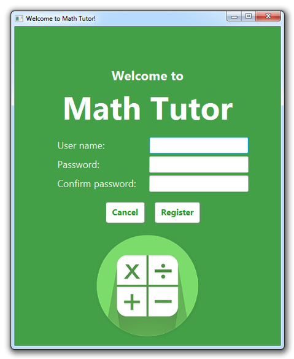
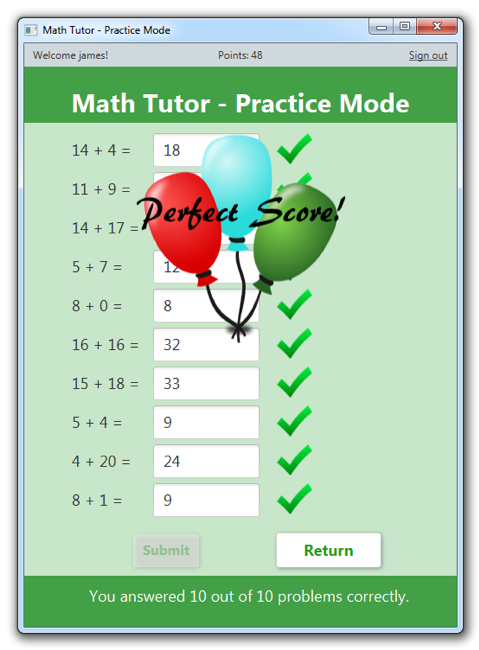

# Math Tutor

An educational program that uses math quizzes to teach arithmetic concepts. Built in Java and MySQL.

## Built With

* JavaFX - UI
* AWS - Server Host

## Screenshots
 

## Contributors
* [Ana Sanchez](https://github.com/anacsanchez)
* Michael Zielinski 
